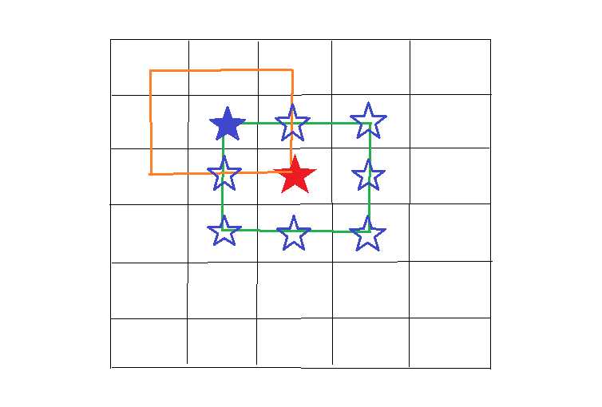

## Mine Sweeper

> 지뢰 찾기

### Features

-   [x] 기본적인 좌클릭 기능 : 클릭시 주변 지뢰개수 정보 출력
-   [x] `연속해서 열기` 구현
-   [x] 우클릭을 통한 깃발 꽂기
-   [x] 게임 난이도 설정(Basic Intermediate Advanced)
-   [x] 게임 커스텀 생성 기능
-   [x] 타이머 기능
-   [x] 기록 저장 기능

### Challenges

-   `연속하여 열기`를 재귀적으로 구현에 있어서 시간 소모가 많았다. 그 이유는 재귀 탈출조건을 정확하게 못잡았기 때문이다.

> 위의 그림을 예를 들어서 지뢰찾기에서 블록이 열리는 과정에 대해서 설명하면서 어떤 점에서 어려웠는지에 대해서 복기해보겠다.

1. 지뢰찾기에서의 클릭의 결과

-   칸에 숫자가 없다.
-   클릭한 주변의 지뢰 개수에 대한 숫자가 있다.

2. 빨간별을 클릭한 경우

-   빨간별 주변의 8개(자신은 제외, 파란별)를 점검해야한다.
-   파란별을 체크한 후, 파란별 중에 존재하는 지뢰개수를 클릭한 빨간별에 표시한다.

3. 숫자가 표현되면 더 이상 주변을 점검할 필요가 없지만, 숫자가 표현되지않는다면(즉, 주변에 지뢰가 없다면) 연속해서 열리는 부분에 있는지를 체크해줘야한다. <이 부분이 재귀적 구현이 필요>

4. 방금전에 점검한 8칸(파란별)에 대해서 각각 주변에 지뢰가 있는지에 대해서 똑같은 작업을 해줘야한다.(주황선처럼 총 8개가 그어진다)

5. 위에서 언급했듯이 각각의 재귀는 그 점검한 포인트에서 숫자가 나온다면 더이상 체크하지 않는다

-   여기서 내가 놓친 부분은 재귀를 돌아야 하는 칸을 추리는 과정에서 나왔다.( ✅ 무조건 8칸이 아니라 최대 8칸이 될 수 있는 것)
-   어떤 칸 주변의 지뢰의 개수가 0이라면 **그 주변에서 클릭이 안된 칸**을 추려야한다. 이 부분을 놓쳐서 무한루프에 빠지게 되었다.

### Need To Improvement

-   리팩토링 필요 : 모듈화

    📌 JS파일(3개)을 분리하여 작업하고자 파일을 나누었는데 같은 변수를 여러군데에서 사용해야 하는 상황이 발생하였다. JS파일은 모두 같은 영역안에서 로딩되기 때문에 `글로벌 변수`로 지정하여 사용하였다. 현재 동작하는데는 문제가 없어 보이지만, 글로벌 변수가 많아지게 되면 가독성이 떨어지고 직간접적으로 다른 변수와 함수에 영향을 미칠수도 있어서 좋은 선택이 아니라고 생각한다. 그래서 JS파일들을 모듈화하여 좀 더 체계적으로 코딩할 필요성이 있어 보인다.

-  함수를 만들어서 코드를 역할 단위로 나워서 코딩을 하였다. 하지만 이게 역으로 너무 많은 함수로 나눠진것이 아닌가 하는 의문이 든다. 또한 비슷한 역할을 하는 함수들도 몇가지 존재하는데 이를 좀 더 추상화시켜서 하나로 합치는 것도 생각해보면 더 깔끔하고 가독성이 좋은 코드를 만들수 있을 것이라 생각한다.    
-   변수명을 좀 더 명확하게 할 필요가 있다.